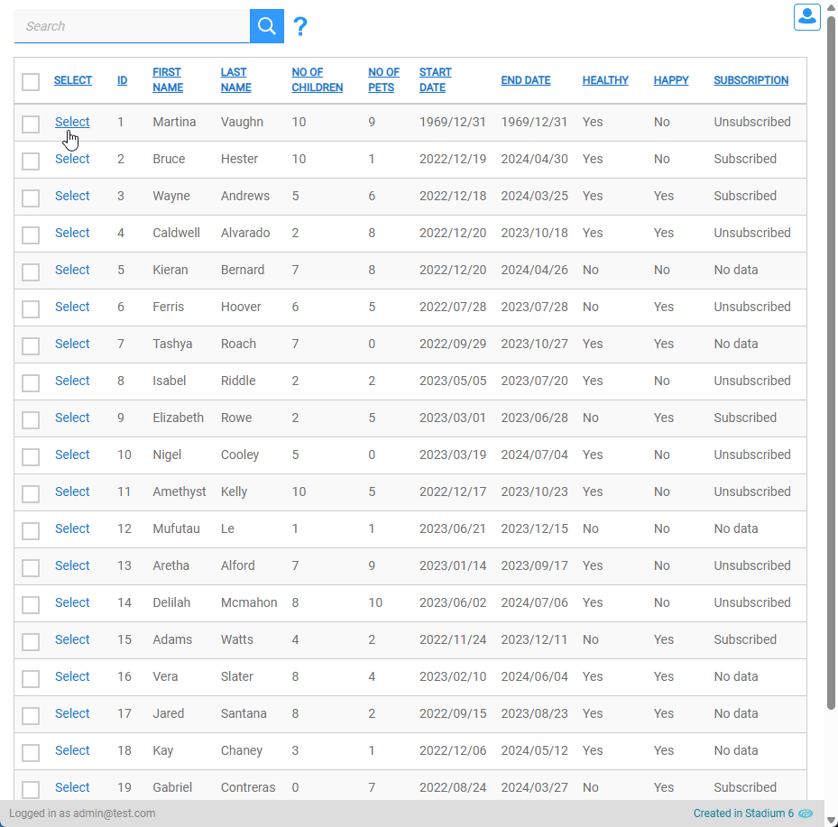
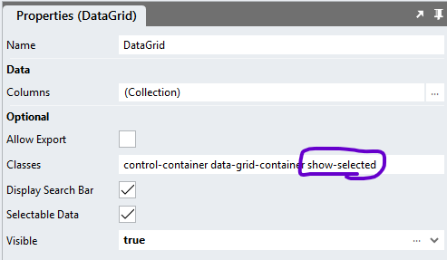

# Select Single dataGrid Row
Script that allows for selecting a single DataGrid row only. 



# Version
1.0

# Setup

## Application Setup
Check the *Enable Style Sheet* checkbox in the application properties

## Global Script Setup
1. Create a Global Script and name it "SelectSingleRow"
2. Add the input parameters below to the script
   1. ClassToAttach
   2. DataGridClass
   3. DeselectCallbackScript
   4. IDColumn
   5. RowIDValue
3. Drag a Javascript action into the script and paste the Javascript below into the action
4. Do not make any changes to any of this script
```javascript
/* Stadium Script v1.0 https://github.com/stadium-software/select-single-datagrid-row */
let scope = this;
let dgClassInput = ~.Parameters.Input.DataGridClass;
let className = ~.Parameters.Input.ClassToAttach;
let idColumn = ~.Parameters.Input.IDColumn;
let idValue = ~.Parameters.Input.RowIDValue;
let callbackScriptName = ~.Parameters.Input.DeselectCallbackScript || "";
if (!dgClassInput) {
    console.error("The DataGridClass parameter is required");
    return false;
}
let dgClassName = `.${dgClassInput}`;
let dg = document.querySelectorAll(dgClassName);
if (dg.length == 0) {
    console.error(`The class '${dgClassInput}' is not assigned to any DataGrid`);
    return false;
} else if (dg.length > 1) {
    console.error("The class '${dgClassInput}' is assigned to multiple DataGrids. DataGrids using this script must have unique classnames");
    return false;
}
dg = dg[0];
let datagridname = dg.id.split("_")[1].replace("-container","");
let tbody = dg.querySelector("table tbody");
if (!idColumn) {
    console.error("The IDColumn parameter is required");
    return false;
}
if (!idValue) {
    console.error("The SelectedRowValue parameter is required");
    return false;
}
if (!className) {
    console.error("The ClassName parameter is required");
    return false;
}
let idColumnNumber = getColumnNumber();
let tries = 0;
let wait = async (milliseconds) => new Promise((resolve) => setTimeout(resolve, milliseconds));
let scriptCaller = async (script, parameters) => {
    tries++;
    if (tries > 20 || !script) {
    	return false;
    } else {
        try {
            await scope[script](parameters);
            return true;
        } catch (error) {
            return wait(100).then(() => scriptCaller(script, parameters));
        }
    }
};
let options = {
    characterData: true,
    attributes: false,
    childList: true,
    subtree: true
},
observer = new MutationObserver(deselectAll);
let targetColumn = tbody.querySelectorAll(`tr td:nth-child(${idColumnNumber})`);
let targetCell, cellParent;
let select = true;
targetColumn.forEach(td => {
    if (td.textContent == idValue) {
        targetCell = td;
    }
});
cellParent = targetCell.parentElement;
if (cellParent.classList.contains(className)) {
    select = false;
}
deselectAll();
if (select) {
    applyClass();
}
function applyClass() { 
    observer.observe(tbody, options);
    cellParent.classList.add(className);
    let rowData = scope[`${datagridname}Data`].find(item => item[idColumn] === idValue);
    window.dgSelectedRowID = function() {
        return rowData;
    };
}
function deselectAll() { 
    observer.disconnect();
    let selectedRow = tbody.querySelector("." + className);
    if (selectedRow) selectedRow.classList.remove(className);
    if (typeof window.dgSelectedRowID === "function") { 
        scriptCaller(callbackScriptName, window.dgSelectedRowID());
        delete window.dgSelectedRowID;
    }
}
function getColumnNumber() {
    let cols = [...scope[`${datagridname}ColumnDefinitions`]] || [];
    if (scope[`${datagridname}HasSelectableData`]) cols.unshift("StadiumRowSelector");
    return cols.findIndex(item => item?.name === idColumn) + 1;
}
```

## Page Setup
1. Add a *DataGrid* control to the page
2. Add a class to uniquely identify the *DataGrid* control to the control classes property (e.g. select-row)
3. Add a clickable column to the DataGrid
4. Populate the *DataGrid* control with data in an event handler




## Page Script
1. Add a script to the page
2. Add an input parameter to the script (e.g. RowData)
3. Add whatever logic in the script that is needed when a row is de-selected

## Column.Click Setup
1. 